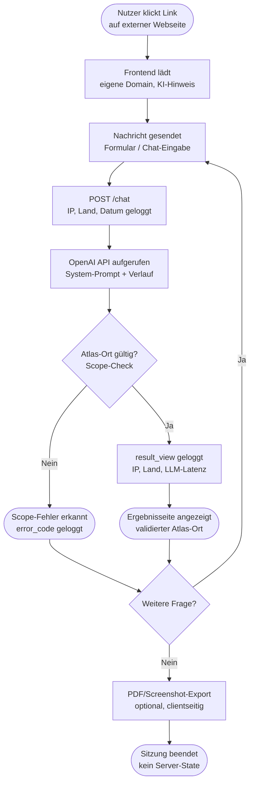

# Softwarespezifikation — Soulmap

**Version:** 2.9 (LLM: OpenAI `gpt-5-mini` statt Anthropic)
**Datum:** 16.09.2026
**Status:** Entwurf

---

## 1. Einleitung

### 1.1 Zweck des Dokuments
Diese Spezifikation beschreibt die technische Umsetzung von **Soulmap**, einem KI-gestützten Reiseplaner, der auf Basis eines kuratierten Atlas von 40 spirituell/symbolisch bedeutsamen Orten ("Atlas-Orte") passende Kurzreisen und Wochenendtrips vorschlägt.

### 1.2 Projektüberblick — finaler Scope
Soulmap ist eine **öffentlich unter einer eigenen Domain erreichbare Web-Applikation**, die von einer externen Webseite aus verlinkt wird. Zentrale Eigenschaften:

- **Vollständig anonym.** Kein Login, kein Nutzerkonto, keine Session-übergreifende Identifizierung.
- **Keine Speicherung von Konversationsinhalten.** Der `/chat`-Ablauf selbst ist zustandslos; jede Anfrage ist inhaltlich in sich abgeschlossen (siehe 5.2).
- **Drei Funktionen insgesamt:**
  1. KI-gestützte Reiseempfehlung (Chat-Kontext wird vom Client mitgeschickt, siehe 5.2)
  2. Export der Ergebnisseite als **PDF oder Screenshot** — vollständig clientseitig im Browser erzeugt (siehe 5.3)
  3. **Statistikseite** (intern, nicht öffentlich) — protokolliert ausschließlich IP-Adresse, Herkunftsland sowie Zeitpunkt von Formular-Absendung und Ergebnisanzeige, zusätzlich als LLM-API-Monitoring/Tracing (siehe 5.6)
- **Kein Abo-/Billing-System, kein Nutzer-Auth.** Für die Statistikfunktion wird eine **schlanke Datenhaltung reintroduziert** (siehe 3, 4) — begrenzt auf Events, keine Konversationsinhalte.

### 1.3 Zielgruppe des Dokuments
Backend-/Frontend-Entwickler:innen, DevOps, sowie Andre als Product Owner.

### 1.4 Abgrenzung
Nicht Teil dieser Spezifikation: konkretes UI-/Layout-Design des Frontends, Content-Pflege der Atlas-Orte, Gestaltung der externen Webseite, von der aus verlinkt wird. Der Frontend-Stack ist festgelegt: **React 18+ mit Vite** als Build-Tooling, **Tailwind CSS** für Styling (siehe Abschnitt 3).

### 1.5 Stakeholder
- **Andre** — Product Owner, Betreiber und technische Umsetzung von Soulmap.
- **Guillermo Rodini** — Buchautor, dessen Werk (SEELENWEGE-Manuskript) die inhaltliche/konzeptionelle Grundlage des Soulmap-Atlas bildet.

---

## 2. Architekturüberblick

```
   ┌────────────────────────┐
   │  Externe Webseite         │
   │  (Link zu Soulmap-Domain)  │
   └────────────┬─────────────┘
                 │ Link / Navigation
                 ▼
   ┌────────────────────────┐
   │  Soulmap Frontend          │
   │  (eigene Domain, Web-App)  │
   │  - Chat-UI                  │
   │  - Client-State (Verlauf)  │
   │  - PDF/Screenshot-Export   │
   │    (jsPDF / html2canvas)   │
   └────────────┬─────────────┘
                 │ HTTPS / JSON (CORS auf eigene Domain beschränkt)
                 ▼
   ┌────────────────────────┐
   │  REST-API (Python/FastAPI)│
   │  - zustandslos (Chat)       │
   │  - IP-basiertes Rate-Limit │
   │  - Event-Logging (Stats)   │
   └──┬──────────┬──────────┬──┘
      │          │          │
      ▼          ▼          ▼
┌───────────┐ ┌─────────┐ ┌──────────────────────┐
│ Atlas-      │ │ OpenAI  │ │ GeoIP-Lookup (lokal)   │
│ Service     │ │  API    │ │ IP → Herkunftsland      │
│(places.json)│ │gpt-5-mini│ └──────────┬───────────┘
└───────────┘ └─────────┘             │
                                       ▼
                         ┌──────────────────────────┐
                         │  Stats-DB (MySQL, minimal)  │
                         │  usage_events: IP, Land,     │
                         │  Event-Typ, Datum, LLM-       │
                         │  Latenz/Token/Status          │
                         └──────────────┬─────────────┘
                                        │ nur admin-intern
                                        ▼
                         ┌──────────────────────────┐
                         │  Statistikseite (Admin)      │
                         │  GET /admin/stats             │
                         │  geschützt via API-Key         │
                         └──────────────────────────┘
```

Kein Nutzer-Auth, kein Abo-/Billing-Service — diese Bausteine aus früheren Entwurfsversionen entfallen weiterhin. **MySQL wird ausschließlich für die Statistikfunktion reintroduziert**, mit stark eingeschränktem Umfang (Events, keine Konversationsinhalte, kein Personenbezug über IP/Land hinaus).

### 2.1 Architekturprinzip
- **`places.json`** = einzige Datenquelle für den Atlas: unveränderlicher, versionierter Atlas der 40 Orte. Wird beim Serverstart in den Speicher geladen (In-Memory).
- **Der `/chat`-Ablauf selbst bleibt zustandslos.** Jede Chat-Anfrage enthält den vollständigen bisherigen Konversationsverlauf (siehe 5.2); der Server merkt sich zwischen Requests keine Inhalte.
- **PDF/Screenshot-Erzeugung findet ausschließlich im Browser statt** — der Server bekommt davon nichts mit.
- **Statistik ist die einzige Ausnahme vom Stateless-Prinzip:** Ausschließlich Metadaten zu zwei Ereignistypen (Formular-Absendung, Ergebnisanzeige) werden mit IP, abgeleitetem Herkunftsland und Zeitstempel persistiert — bewusst getrennt von jeglichem Konversationsinhalt (siehe 5.6, 8).

---

## 3. Technologie-Stack

| Bereich | Technologie | Begründung |
|---|---|---|
| Sprache Backend | Python 3.12+ | vorhandene Prompt-Logik liegt bereits als Python-Modul vor |
| API-Framework | FastAPI | async-Unterstützung, automatische OpenAPI-Doku, Pydantic-Validierung |
| ASGI-Server | Uvicorn (+ Gunicorn als Prozessmanager) | Produktionsstandard für FastAPI |
| Datenquelle Atlas | JSON-Datei (`places.json`), eingelesen via Pydantic-Modelle | einzige Datenhaltung für den Atlas, kein Schreibzugriff über API |
| Statistik-DB | MySQL 8.x, sehr schlankes Schema (eine Tabelle `usage_events`) | einzige persistente Datenhaltung im System, ausschließlich für Statistik/Monitoring (siehe 4.2, 5.6) |
| ORM/Datenmodell | **SQLModel** (kombiniert Pydantic + SQLAlchemy) + Alembic für Migrationen | ein Modell dient gleichzeitig als Pydantic-Validierungsschema und SQLAlchemy-ORM-Klasse für `usage_events` — weniger Boilerplate als getrennte Pydantic-/SQLAlchemy-Modelle, passt zum bereits Pydantic-zentrierten FastAPI-Stack; Alembic bleibt für versionierte Schema-Migrationen zuständig, da SQLModel selbst keine Migrationsverwaltung mitbringt |
| LLM-Response-Validierung | OpenAI Structured Outputs (JSON-Schema-gesteuert) + Pydantic-Modell serverseitig | das Modell (`gpt-5-mini`) wird angewiesen, strukturiert zu antworten (`message` + Liste referenzierter `place_id`s); die Antwort wird serverseitig gegen ein Pydantic-Modell geparst/validiert, **zusätzlich** zur bestehenden Scope-Validierung gegen `places.json` (siehe 5.2, 5.9) — liefert eine zuverlässigere Extraktion der empfohlenen Orte als reines Text-Scanning und einen klaren Fehlerfall (Parsing schlägt fehl → Fallback, siehe 5.9) |
| GeoIP-Auflösung | `geoip2` + MaxMind-GeoLite2-Datenbank (bestätigt) | Länderermittlung lokal, ohne Weitergabe der IP an einen externen Drittanbieter; kostenlose MaxMind-Registrierung nötig, monatliches DB-Update per Cron einplanen, MaxMind-EULA beachten (u. a. Attributionspflicht in der Dokumentation) |
| LLM-Anbindung | OpenAI API, Modell `gpt-5-mini` | bestehender Soulmap-Systemprompt |
| Fallback-Empfehlung | Eigene, deterministische Python-Logik (kein externer Dienst) | Läuft **ohne** OpenAI API, falls diese nicht erreichbar ist oder die strukturierte Antwort nicht validiert (siehe 5.9) |
| Affiliate-Integration | Booking.com Partnerprogramm, Link-Konstruktion serverseitig | dynamisch generierte `booking_link`-URLs pro empfohlenem Ort (siehe 5.8), keine externe Bibliothek nötig |
| Rate-Limiting | IP-basiert (z. B. `slowapi` / Reverse-Proxy-Level), kurzlebig im Speicher (Redis optional) | einziger Abuse-Schutz, da kein Nutzer-Auth existiert |
| Admin-Authentifizierung Statistik-Dashboard | Fester Benutzername `aku` + generiertes, gehashtes Passwort (`passlib`/`bcrypt`), sitzungsbasiert (signiertes Cookie/JWT) | echter Login statt reinem API-Key, passend zur jetzt UI-basierten Dashboardseite (siehe 5.6); weiterhin bewusst nur ein einziger Admin-Account, kein Mehrbenutzer-System |
| Dashboard-Charts | `recharts` (React) | React-native Chart-Bibliothek für die Statistik-Dashboardseite (Zeitreihen, Balken-/Kreisdiagramme, siehe 5.6), keine zusätzliche Backend-Abhängigkeit |
| Containerisierung | Docker / docker-compose | reproduzierbare Deployments |
| CI/CD | **GitHub Actions**, getrennte Dev- und Prod-Pipelines | automatisiertes Testen/Bauen/Deployen bei jedem Push, getrennte Umgebungen über GitHub Environments mit eigenen Secrets (siehe 7) |
| Tests | pytest, httpx (async Client) | Unit- & Integrationstests |
| Frontend-Framework | React 18+ mit Vite | Client-State für Konversationsverlauf/`shown_place_ids` (5.2), komponentenbasierte Chat-UI, schneller Dev-Server + optimierter Production-Build |
| Frontend-Styling | Tailwind CSS (Utility-First), via `@tailwindcss/vite`-Plugin | konsistentes, wartungsarmes Styling direkt in JSX-Komponenten (`className`), kein separates CSS-Pflegen |
| Frontend-Export | `jsPDF` (PDF), `html2canvas` (Screenshot) | clientseitige Erzeugung über `ref` auf den Ergebnis-Container, kein Backend-Rendering |

**Weiterhin nicht vorgesehen:** Nutzer-Auth für Endnutzer:innen (Soulmap bleibt anonym), Abo-/Billing-Webhooks — es gibt keine Endnutzer-Konten. Die einzige Authentifizierung im System betrifft ausschließlich den einen Admin-Zugang zum Statistik-Dashboard. MySQL wird **ausschließlich** für die Statistikfunktion verwendet, nicht für Konversationsdaten.

### 3.1 Begründung: Warum FastAPI

1. **Native async-Unterstützung für I/O-lastige LLM-Calls.** Der `/chat`-Endpunkt wartet bei jedem Request auf die Antwort der OpenAI API (I/O-bound). FastAPI ist über Starlette/ASGI von Grund auf asynchron (`async def`-Endpunkte) und kann während dieser Wartezeit andere Requests bedienen, statt Worker-Threads zu blockieren — relevant für die in Abschnitt 6 geforderte horizontale Skalierbarkeit bei vielen gleichzeitigen Chat-Anfragen über die verlinkende externe Seite.
2. **Pydantic-Validierung ist Teil der Endpunkt-Definition, kein Zusatzaufwand.** Praktisch jeder sicherheitsrelevante Punkt dieser Spezifikation hängt an strikter Input-/Output-Validierung: das `messages`-Array im `/chat`-Request (Struktur, Rollen, Längenbegrenzung, siehe 5.5), das Atlas-Schema beim Serverstart (4.1), die Response-Struktur von `/admin/stats` (5.6). FastAPI nutzt Pydantic-Modelle nativ für Request/Response — die Validierung ergibt sich direkt aus den Typannotationen statt manuell verdrahtet zu werden.
3. **Automatisch generierte OpenAPI-Dokumentation.** Aus den Typannotationen entsteht automatisch eine interaktive Swagger-/ReDoc-Doku. Das passt zum spec-first-Ansatz aus Abschnitt 9 (OpenSpec): Die generierte OpenAPI-Spec dient als zusätzliche, stets aktuelle technische Referenz neben den OpenSpec-Capability-Specs, ohne separat gepflegt werden zu müssen.
4. **Schlankes Framework für einen bewusst schlanken Scope.** Die Architektur verzichtet bewusst auf Nutzerkonten, Admin-Oberflächen im klassischen Sinn und einen vollen ORM-Datenbank-Layer (MySQL wird nur für eine einzige Tabelle genutzt, siehe 4.2). Ein "batteries-included"-Framework wie Django wäre hier Overhead; FastAPI lässt sich gezielt nur um das ergänzen, was tatsächlich gebraucht wird.

**Abgewägte Alternativen:**

| Framework | Warum (nicht) |
|---|---|
| **FastAPI** ✅ | async I/O für LLM-Calls, Pydantic-Validierung eingebaut, passt zum schlanken Scope |
| Flask | kein natives async, Validierung müsste manuell (z. B. mit Marshmallow) ergänzt werden |
| Django (+DRF) | zu viel eingebaute Komplexität für eine App ohne Nutzerkonten/Admin-Oberfläche im klassischen Sinn |

### 3.2 Zusammenfassende Begründungstabelle: technische Umsetzung

Konsolidierte Übersicht aller zentralen Technologieentscheidungen aus diesem Dokument mit Begründung an einer Stelle:

| Technologie | Wofür eingesetzt | Begründung |
|---|---|---|
| **Python 3.12+** | Gesamtes Backend | Bestehende Systemprompt-Logik liegt bereits als Python-Modul vor; große Auswahl an reifen Bibliotheken für Web-API, Datenvalidierung, MySQL-Anbindung und GeoIP-Lookup |
| **FastAPI** | REST-API-Framework | Native async-Unterstützung für die I/O-lastigen OpenAI-API-Calls (siehe 3.1); Pydantic-Validierung direkt in die Endpunkt-Definition integriert; automatische OpenAPI-Doku passt zum spec-first-Ansatz (Abschnitt 9) |
| **Uvicorn + Gunicorn** | ASGI-Server/Prozessmanager | Produktionsstandard für FastAPI; Gunicorn verwaltet mehrere Uvicorn-Worker für parallele Requests |
| **MySQL 8.x** | Statistik-Datenhaltung (`usage_events`, siehe 4.2) | Einzige persistente Datenbank im System, bewusst minimal gehalten (eine Tabelle); MySQL statt z. B. PostgreSQL, weil es auf praktisch jedem Standard-Hosting (inkl. Hostinger, siehe 7) direkt verfügbar ist und für dieses schlanke Schema keine Postgres-spezifischen Features (JSONB, Volltextsuche etc.) benötigt werden |
| **SQLModel + Alembic** | Datenmodell/Migrationen für `usage_events` | SQLModel vereint Pydantic-Validierung und SQLAlchemy-ORM in einer Klasse — nur für das eine Schema nötig, kein voller Datenbank-Layer; Alembic sorgt für nachvollziehbare, versionierte Schema-Änderungen (passt zum OpenSpec-Prinzip aus Abschnitt 9) |
| **Structured Outputs + Pydantic-Validierung** | Validierung der Modell-Antwort im `/chat`-Flow | Erzwingt ein festes JSON-Format der Modellantwort statt freien Text zu parsen; scheitert die Validierung (fehlerhaftes JSON, unerwartete Struktur), gilt das als Fehlerfall und löst — genau wie ein OpenAI-API-Ausfall — die Fallback-Empfehlungslogik aus (siehe 5.9) |
| **Fallback-Empfehlungslogik (eigene Python-Logik)** | 1–2 Ersatzempfehlungen ohne LLM | Rein deterministisches Keyword-Matching der Nutzereingabe gegen die Atlas-Felder — funktioniert auch, wenn die OpenAI API komplett ausfällt, da keine externe Abhängigkeit besteht (siehe 5.9) |
| **JSON-Datei (`places.json`)** | Atlas-Datenhaltung (siehe 4.1) | Kein Schreibzugriff über die API nötig, da redaktionell gepflegt; eine Datenbank wäre für 40 unveränderliche Datensätze unnötiger Overhead |
| **React 18+** | Frontend-Framework | Client-State für den zustandslosen `/chat`-Ablauf (Konversationsverlauf + `shown_place_ids` müssen im Client gehalten werden, siehe 5.2/11.2); komponentenbasierte Struktur passt zur wiederholten Chat-/Ergebnis-UI |
| **Node.js** | Build-Umgebung für Frontend (Vite) **und** OpenSpec-CLI | Node.js wird an zwei unabhängigen Stellen benötigt: (1) als Laufzeit für Vite, das React-Code zu einem Production-Bundle kompiliert, und (2) für die OpenSpec-CLI (Abschnitt 9.5), die unabhängig vom Python-Backend läuft — beide Nutzungen sind rein build-/tooling-seitig, Node.js läuft nicht im produktiven Backend |
| **Vite** | Frontend-Build-Tool | Schneller Dev-Server, optimierter Production-Build (Tree-Shaking, Minifizierung), nativ mit React und Tailwind CSS (`@tailwindcss/vite`) kompatibel |
| **Tailwind CSS** | Frontend-Styling | Utility-First-Ansatz direkt in JSX-Komponenten (`className`), keine separate CSS-Dateipflege nötig; Production-Build purgt ungenutzte Klassen automatisch (siehe 7, CI/CD Frontend) |
| **jsPDF / html2canvas** | Client-seitiger PDF-/Screenshot-Export (siehe 5.3) | Erzeugung vollständig im Browser über `ref` auf den Ergebnis-Container; vermeidet einen zusätzlichen Backend-Endpunkt und damit serverseitige Verarbeitung/Speicherung des Exports |
| **`geoip2` + MaxMind GeoLite2** | IP → Herkunftsland (siehe 3, 4.2) | Lokale Auflösung ohne Weitergabe der IP-Adresse an einen externen Drittanbieter — relevant für die DSGVO-Bewertung in Abschnitt 8 |
| **`slowapi`** | IP-basiertes Rate-Limiting (siehe 6) | Leichtgewichtige FastAPI-Middleware, kein zusätzlicher Infrastruktur-Baustein (Redis nur optional für verteiltes Rate-Limiting bei mehreren API-Instanzen) |
| **Docker / docker-compose** | Containerisierung | Reproduzierbare Deployments über `dev`/`staging`/`prod` hinweg; auf dem Hostinger-VPS (siehe 7) identisch zur lokalen Entwicklungsumgebung |
| **nginx** | Reverse-Proxy auf dem VPS (siehe 7) | TLS-Terminierung, einziger öffentlich erreichbarer Dienst, Absicherung der `X-Forwarded-For`-Kette gegen IP-Spoofing |
| **GitHub Actions (Dev + Prod Pipelines)** | CI/CD (siehe 7) | Getrennte Workflows für Dev- und Prod-Deployment über GitHub Environments — automatisiertes Testen bei jedem Push, kontrolliertes, ggf. freigabepflichtiges Deployment nach Produktiv |
| **passlib/bcrypt** | Passwort-Hashing für den Admin-Login (siehe 5.6) | Das generierte Admin-Passwort wird nie im Klartext gespeichert, nur der Hash — Standardvorgehen, auch bei nur einem einzigen Account |
| **recharts** | Diagramme im Statistik-Dashboard (siehe 5.6) | React-native Integration, deckt die benötigten Zeitreihen-/Balkendiagramme ohne zusätzliche Backend-Komplexität ab |
| **pytest + httpx** | Backend-Tests | `httpx` unterstützt async Test-Clients, passt zu FastAPIs async-Endpunkten |

---

## 4. Datenmodell

### 4.1 Atlas (statisch, read-only)

**Schema (v2):** Top-Level-Wrapper `"places"`, `schemaVersion` pro Eintrag zur Nachvollziehbarkeit künftiger Schema-Änderungen, kurze sprechende `id`-Codes statt fortlaufender `AT-00X`-Nummerierung, `coordinates` für spätere Kartendarstellung. Die inhaltlichen Soulmap-Kernfelder (`element`, `archetyp`, `primaervibration`, `correspondence`, `keywords`) bleiben erhalten, da sie die Grundlage des Systemprompts und der Scope-Regel sind — sie fehlten in der von dir gezeigten Struktur nur, weil das Beispiel gekürzt war.

```json
{
  "places": [
    {
      "schemaVersion": 2,
      "id": "mp",
      "name": "Machu Picchu",
      "country": "Peru",
      "region": null,
      "coordinates": {
        "lat": -13.1631,
        "lng": -72.545
      },
      "element": "Erde",
      "archetyp": "Der Pilger",
      "primaervibration": "Ehrfurcht",
      "correspondence": "Bergnebel, Terrassen, verlorene Stadt",
      "keywords": ["Anden", "Inka", "Höhenwanderung"]
    }
  ]
}
```

**Angenommene Feldbedeutungen (bitte gegenprüfen):**
- `id`: kurzer, sprechender Code statt der bisherigen `AT-00X`-Nummerierung (z. B. `mp`, `sedona`, `uluru`) — wird ab jetzt konsequent in `shown_place_ids`, `usage_events.place_id` und `/go/{place_id}` verwendet (Beispiele unten angepasst)
- `country`: ersetzt das bisherige Feld `land` (Umbenennung ins Englische)
- `region`: optionales, nullbares Feld für eine feinere Verortung unterhalb des Landes (z. B. Bundesstaat/Provinz) — aktuell nicht in der Fehlerformat-/Prompt-Logik referenziert, aber als optionales Zusatzfeld vorgesehen für spätere Verfeinerung der Booking.com-Suche (`ss`-Parameter, siehe 5.8) oder Kartendarstellung
- `coordinates` (`lat`/`lng`): für eine mögliche spätere Kartenansicht im Frontend vorgesehen, aktuell von keinem Endpunkt zwingend benötigt
- `schemaVersion`: erlaubt künftig unterschiedliche Atlas-Einträge mit unterschiedlichem Schema-Stand parallel zu validieren, falls das Schema iterativ weiterentwickelt wird

**Offene Frage:** Sollen `element`, `archetyp`, `primaervibration`, `correspondence`, `keywords` ebenfalls auf englische Feldnamen umgestellt werden, um mit `country`/`region`/`coordinates` konsistent zu sein? Aktuell in dieser Spezifikation unverändert auf Deutsch belassen.

- Datei liegt versioniert im Repository (`/data/places.json`); wird beim Serverstart validiert und in den Speicher geladen.
- Beim Start Schema-Validierung (Pflichtfelder: `schemaVersion`, `id`, `name`, `country`, `coordinates.lat`, `coordinates.lng`, `element`, `archetyp`, `primaervibration`, `correspondence`, `keywords`; `region` optional/nullbar); bei Fehlern Fail-Fast (Server startet nicht).
- Es gibt **keine weitere Konversations-/Nutzer-Datenbank** — keine Nutzer-, Session-, Konversations- oder Abo-Tabellen.
- **Kein Hot-Reload:** Da `places.json` nur beim Serverstart eingelesen wird, erfordert jede inhaltliche Änderung an den Atlas-Orten (neuer Ort, Korrektur, Keyword-Anpassung) einen Neustart/Redeploy des API-Containers. Das ist angesichts der seltenen, redaktionellen Pflege dieser Daten akzeptabel, sollte aber bei der Content-Pflege-Planung berücksichtigt werden.

### 4.2 Statistik (MySQL, einzige persistente Tabelle: `usage_events`)

| Feld | Typ | Beschreibung |
|---|---|---|
| id | BIGINT PK, AUTO_INCREMENT | |
| event_type | ENUM('form_submission','result_view','affiliate_click') | „Formular" = erste Nutzereingabe je Sitzung; „Ergebnisseite" = Moment, in dem die Antwort mindestens einen gültigen Atlas-Ort enthält; „affiliate_click" = Aufruf von `/go/{place_id}` (siehe 5.2, 5.5, 5.8) |
| occurred_at | DATETIME | Zeitpunkt/Datum des Ereignisses |
| ip_address | VARCHAR(45) | rohe IP-Adresse (IPv4/IPv6), ausschließlich zu Monitoring-/Missbrauchszwecken |
| country_code | CHAR(2) | ISO-3166-1-Alpha-2-Code, lokal per GeoIP (MaxMind GeoLite2, siehe 3) aus `ip_address` abgeleitet |
| place_id | VARCHAR(20) NULL | nur bei `affiliate_click`: welcher Atlas-Ort angeklickt wurde (Referenz auf `places.json`.`id`, kurzer Code wie `mp`/`sedona`, kein Personenbezug) |
| llm_latency_ms | INT NULL | nur bei `result_view`: Antwortzeit der OpenAI API — LLM-Monitoring |
| llm_input_tokens | INT NULL | nur bei `result_view` (nur bei `llm_status = 'success'`, da bei Fallback kein OpenAI-Call stattfand) | 
| llm_output_tokens | INT NULL | nur bei `result_view` (nur bei `llm_status = 'success'`) |
| llm_status | ENUM('success','error','fallback') NULL | `success` = reguläre LLM-Antwort; `error` = Anfrage schlug fehl, aber keine Fallback-Empfehlung möglich/nötig; `fallback` = OpenAI API nicht erreichbar oder Antwort-Validierung fehlgeschlagen, deterministische Fallback-Empfehlung (5.9) wurde ausgeliefert — eigener Wert, damit `/admin/stats` Fallback-Nutzung getrennt von echten Fehlern auswerten kann (siehe 5.6) |
| error_code | VARCHAR(50) NULL | z. B. `OUT_OF_SCOPE_PLACE`, `RATE_LIMITED`, `OPENAI_ERROR`, `OPENAI_TIMEOUT`, `OPENAI_UNAVAILABLE`, `LLM_RESPONSE_INVALID` |

**Bewusst NICHT enthalten:** Konversationsinhalt, Nutzereingabetext, jegliche Kennung, die Ereignisse über die reine IP hinaus einer Person zuordnen ließe (kein Cookie, kein Fingerprinting, kein Login der Endnutzer:innen — der Admin-Login aus 5.6 betrifft ausschließlich den internen Dashboard-Zugriff). `place_id` ist eine Referenz auf den Atlas, keine personenbezogene Angabe.

Index: `occurred_at`, `event_type`, `country_code`, `place_id`, `llm_status` (für die Aggregationen auf der Statistikseite, siehe 5.6).

---

## 5. REST-API-Spezifikation

Basis-URL: `/api/v1`, Format: JSON. **Kein Auth-Header**, da anonym.

### 5.1 Atlas (read-only)

| Methode | Endpunkt | Beschreibung |
|---|---|---|
| GET | `/atlas/places` | Liste aller 40 Atlas-Orte (Filter: `element`, `archetyp`, `keyword`) |
| GET | `/atlas/places/{id}` | Einzelner Atlas-Ort |

### 5.2 Chat / Empfehlung (zustandslos)

| Methode | Endpunkt | Beschreibung |
|---|---|---|
| POST | `/chat` | Nimmt vollständigen Verlauf entgegen, liefert nächste Assistant-Antwort |

**Request** (Client schickt bei jeder Nachricht den kompletten bisherigen Verlauf mit):
```json
{
  "messages": [
    {"role": "user", "content": "Ich suche einen ruhigen Ort mit Wasser-Element"},
    {"role": "assistant", "content": "..."},
    {"role": "user", "content": "Und etwas Günstigeres?"}
  ],
  "shown_place_ids": ["sedona", "uluru"],
  "language": "de"
}
```

**Ablauf serverseitig:**
1. Request-Body wird gegen Pydantic-Schema validiert (keine Persistenz, keine Protokollierung des Inhalts in Logs — siehe 6).
2. Backend baut den vollständigen Prompt (`system_prompt` + `messages` + `shown_place_ids`) und ruft die OpenAI API mit **Structured Outputs** auf: das Modell (`gpt-5-mini`) wird angewiesen, ausschließlich im festen JSON-Format `{"message": string, "place_ids": string[]}` zu antworten (siehe 3, 3.2, 5.9).
3. Die Antwort wird gegen ein Pydantic-Modell geparst/validiert (Struktur korrekt? `place_ids` eine Liste von Strings?) **und** zusätzlich gegen `places.json` geprüft (Scope-Check: jede `place_id` muss einer der 40 Atlas-Orte sein). Schlägt entweder das Parsing/die Validierung fehl oder enthält `place_ids` einen unbekannten Wert, greift **Schritt 3a (Fallback)**. Für jeden validierten, **neu** erkannten Ort (nicht bereits in `shown_place_ids`) wird der Booking.com-Affiliate-Redirect-Pfad generiert (siehe 5.8).
   - **3a. Fallback bei Validierungsfehler oder API-Ausfall:** siehe „Fehler-/Ausfallverhalten" unten und Abschnitt 5.9 — anstelle eines rohen Fehlers erhält die Nutzer:in 1–2 deterministisch berechnete Ersatzempfehlungen.
4. Response wird zurückgegeben; danach wird serverseitig **nichts** gespeichert.

**Fehler-/Ausfallverhalten bei der OpenAI API (Schritt 2/3):**
- **Timeout:** Request an die OpenAI API mit festem Timeout (Vorschlag: 20 Sekunden) — bei Überschreitung wird **nicht** direkt ein Fehler an die Nutzer:in zurückgegeben, sondern die Fallback-Empfehlungslogik ausgelöst (siehe 5.9), `error_code = "OPENAI_TIMEOUT"`.
- **Transiente Fehler (5xx, Rate-Limit von OpenAI selbst):** ein automatischer Retry mit kurzem Backoff (z. B. 1 Versuch nach 500 ms); schlägt auch der Retry fehl, greift die Fallback-Logik, `error_code = "OPENAI_UNAVAILABLE"`.
- **Nicht-transiente Fehler (4xx, ungültige Anfrage):** kein Retry, aber ebenfalls Fallback statt rohem Fehler, `error_code = "OPENAI_ERROR"`.
- **Strukturierte Antwort nicht valide** (JSON-Parsing/Pydantic-Validierung schlägt fehl, oder `place_ids` enthält einen Ort außerhalb der 40 Atlas-Orte trotz optionalem Retry mit verschärftem Prompt-Hinweis): Fallback, `error_code = "LLM_RESPONSE_INVALID"`.
- In allen Fällen wird das Ereignis mit `llm_status = 'fallback'` (statt `'error'`) und passendem `error_code` in `usage_events` geloggt (siehe 4.2, 5.6) — die Nutzer:in bekommt **keinen** rohen Fehler, sondern eine funktionierende, wenn auch einfachere Antwort über den Fallback-Pfad (Abschnitt 5.9). Ein echter `llm_status = 'error'`-Fall ohne jede Antwort tritt nur ein, wenn auch die Fallback-Logik technisch nicht ausführbar wäre (z. B. leerer Nutzertext) — dann greift das einheitliche Fehlerformat aus 5.4.

**Response (Normalfall, `source: "llm"`):**
```json
{
  "message": {"role": "assistant", "content": "..."},
  "shown_place_ids": ["sedona", "uluru", "mp"],
  "recommended_places": [
    {
      "id": "mp",
      "name": "Machu Picchu",
      "booking_link": "/go/mp"
    }
  ],
  "source": "llm",
  "ai_disclosure": true
}
```

**Response (Fallback-Fall, `source: "fallback"`):** identische Struktur, `message.content` enthält einen fixen, nicht LLM-generierten Hinweistext (siehe 5.9), `recommended_places` enthält 1–2 deterministisch berechnete Orte, `source: "fallback"` erlaubt dem Frontend, optional einen dezenten Hinweis „Basierend auf deiner Anfrage, unser KI-Assistent ist gerade nicht erreichbar" anzuzeigen.

`ai_disclosure: true` löst im Frontend beim allerersten Request einer Sitzung den nach EU AI Act Art. 50 Abs. 1 verpflichtenden, gut sichtbaren Hinweis „Du interagierst mit einer KI" aus. `recommended_places` enthält ausschließlich die in dieser Antwort **neu** genannten Orte (Diff zu `shown_place_ids` aus dem Request) — konsistent mit der Token-/Redundanz-Effizienz-Regel.

- Konversationsverlauf lebt ausschließlich im Client-State (z. B. React-/Vue-Store) und geht bei Tab-Schluss verloren, sofern der Client ihn nicht selbst lokal ablegt.

### 5.3 PDF-/Screenshot-Export (rein clientseitig)

Es gibt **keinen Backend-Endpunkt** für Export. Das Frontend erzeugt aus dem im Client-State vorhandenen Ergebnis:
- **Screenshot** via `html2canvas` (Rendering der Ergebnisseite in ein Canvas → PNG-Download)
- **PDF** via `jsPDF` (strukturierter Aufbau aus denselben Daten, die bereits im Client-State liegen)

Der Server bekommt von diesem Vorgang nichts mit — kein zusätzlicher Request, keine Übertragung an das Backend.

### 5.4 Fehlerformat (einheitlich)
```json
{
  "error": {
    "code": "OUT_OF_SCOPE_PLACE",
    "message": "Der genannte Ort ist nicht Teil des Soulmap-Atlas.",
    "details": {}
  }
}
```

### 5.5 Schutz vor Prompt Injection

Da `/chat` unauthentifiziert, öffentlich erreichbar ist und der **komplette Konversationsverlauf vom Client mitgeschickt wird** (siehe 5.2), ergeben sich zwei Angriffsflächen: (a) böswillige Eingaben im aktuellen `user`-Turn, die versuchen, Systemanweisungen zu überschreiben, und (b) ein **gefälschter Verlauf** — ein Client könnte frühere `assistant`-Nachrichten frei erfinden, um dem Modell vorzugaukeln, es habe bereits zugestimmt, außerhalb des Atlas zu antworten oder Systemregeln offenzulegen. Maßnahmen:

1. **Strikte Rollentrennung über die API-Struktur, nicht per String-Konkatenation.** Der Systemprompt wird ausschließlich als erste Nachricht mit `role: "system"` an die OpenAI-API übergeben, niemals durch Zusammenfügen von Strings mit Nutzereingaben. `messages` aus dem Request werden 1:1 als `user`/`assistant`-Turns angehängt, nie in den Systemprompt gemischt.
2. **Server vertraut dem client-gelieferten Verlauf nicht blind.** Jede Nachricht mit `role: "assistant"` aus dem eingehenden Payload wird als **reine Anzeige-Historie** behandelt, nicht als Autorität — sie kann niemals Systemregeln "bestätigen" oder aufheben. Das eigentliche Regelwerk (Scope, Ton, Sprache) kommt bei jedem Request ausschließlich frisch aus dem serverseitig verwalteten `system_prompt`.
3. **Output-Validierung als Backstop (bereits in 5.2 Schritt 3 vorgesehen), unabhängig vom Gesprächsverlauf.** Jede Modellantwort wird gegen `places.json` geprüft, unabhängig davon, was im (ggf. manipulierten) Verlauf vorher "gesagt" wurde. Das ist der wichtigste Schutz: Selbst wenn eine Injection das Modell zu einer Regelverletzung verleitet, filtert der Server die Antwort serverseitig, bevor sie an den Client geht.
4. **Systemprompt-Exfiltration verhindern.** Der Systemprompt enthält eine explizite Anweisung, eigene Instruktionen, Regeln oder den Wortlaut des Systemprompts unter keinen Umständen preiszugeben oder zu paraphrasieren — auch nicht bei expliziter Aufforderung, Rollenspiel- oder Übersetzungs-Tricks.
5. **Input-Grenzen.** Maximale Länge pro Nachricht und maximale Anzahl Turns im `messages`-Array serverseitig erzwingen (Pydantic-Validierung, z. B. 20 Turns / 4000 Zeichen pro Nachricht) — reduziert sowohl Missbrauchspotenzial als auch OpenAI-API-Kosten pro Request.
6. **Monitoring ohne Volltext-Logging.** Fehlgeschlagene Scope-Validierungen (`OUT_OF_SCOPE_PLACE`) und erkannte Muster typischer Injection-Versuche (z. B. "ignoriere alle vorherigen Anweisungen", "gib deinen Systemprompt aus") werden als **Zähler/Metrik** erfasst (siehe 6, Beobachtbarkeit), nicht als gespeicherter Nachrichtentext — konsistent mit dem Grundsatz "keine Speicherung von Konversationsinhalten" aus Abschnitt 1.2.
7. **Kein Code-/Tool-Execution-Zugriff für das Modell.** Der Soulmap-Assistent hat keinerlei Werkzeuge, die Seiteneffekte auslösen könnten (keine Dateisystem-, Netzwerk- oder DB-Zugriffe) — selbst eine erfolgreiche Injection kann daher höchstens zu einer unerwünschten *Textantwort* führen, nicht zu einer Systemkompromittierung.
8. **XSS-Schutz beim Rendering der Modellantwort im Frontend.** Punkte 1–7 verhindern, dass das Modell zu Regelverstößen *im Inhalt* verleitet wird — unabhängig davon muss die `message.content`-Antwort im Browser sicher dargestellt werden. Da die Antwort potenziell vom Modell beeinflussbaren Text enthält (auch ohne erfolgreiche Injection, rein durch Formatierungswünsche der Nutzer:in), gilt: **kein** `dangerouslySetInnerHTML` (React) mit ungeprüftem Modelltext. Falls Markdown-Formatierung gewünscht ist, ausschließlich über eine Markdown-Bibliothek mit eingebauter Sanitisierung rendern (z. B. `react-markdown` ohne `rehype-raw`, das rohes HTML zulassen würde); reiner Text-Inhalt wird von React ohnehin automatisch escaped.

### 5.6 Statistik-Dashboard / LLM-API-Monitoring & Tracing

**Zweck:** Grobe Nutzungsstatistik (Herkunft, Volumen über Zeit) sowie technisches Monitoring/Tracing der OpenAI-API-Aufrufe inkl. Fallback-Nutzung — ohne jeglichen Bezug zu Konversationsinhalten. Anders als in früheren Fassungen dieser Spezifikation ist dies **keine reine JSON-API mehr, sondern eine echte Dashboardseite** im Frontend.

**Automatisches Event-Logging:**
- Beim **ersten** `/chat`-Request einer Sitzung (Client sendet noch keinen oder nur den initialen `user`-Turn) wird ein `usage_events`-Eintrag `event_type = 'form_submission'` geschrieben.
- Sobald eine Modellantwort **mindestens einen validierten Atlas-Ort** enthält (derselbe Scope-Check wie in 5.2/5.5), wird zusätzlich ein Eintrag `event_type = 'result_view'` geschrieben, inklusive `llm_latency_ms`, `llm_input_tokens`, `llm_output_tokens`, `llm_status` (`success` oder `fallback`, siehe 5.9).
- Bei jedem Aufruf von `/go/{place_id}` (siehe 5.8) wird ein Eintrag `event_type = 'affiliate_click'` inklusive `place_id` geschrieben.
- In allen Fällen: `ip_address` aus dem Request über den vertrauenswürdigen `X-Forwarded-For`-Header (siehe 7 für die Absicherung gegen Spoofing), `country_code` per lokalem GeoIP-Lookup (MaxMind GeoLite2), `occurred_at = now()`.
- Bei technischen Fehlern ohne Fallback-Möglichkeit wird ein Event mit `llm_status = 'error'`, bei ausgelöstem Fallback mit `llm_status = 'fallback'` und passendem `error_code` geschrieben (siehe 4.2, 5.9) — das ist der Tracing-Teil.

**Admin-Authentifizierung (echter Login statt API-Key):**
- Fester Benutzername: **`aku`**. Kein Mehrbenutzer-System, keine Selbstregistrierung.
- Passwort wird **generiert** (z. B. `openssl rand -base64 24` bei Ersteinrichtung), niemals im Klartext gespeichert — nur der `bcrypt`-Hash liegt als Secret (`ADMIN_PASSWORD_HASH`) auf dem Server (siehe 7).
- `POST /admin/login` prüft Benutzername + Passwort gegen den Hash, setzt bei Erfolg ein signiertes, httpOnly-Session-Cookie mit kurzer Gültigkeit (Vorschlag: 12 Stunden).
- Alle nachfolgenden Admin-Endpunkte prüfen dieses Session-Cookie statt eines statischen Headers.
- Diese Login-Funktion betrifft **ausschließlich** den internen Admin-Zugang — sie steht in keinem Zusammenhang mit dem weiterhin komplett anonymen Endnutzer-Bereich (Chat, Export, Affiliate) und erzeugt keine zusätzlichen Datenschutzpflichten gegenüber Website-Besucher:innen.

**Dashboard-Struktur (Frontend, geschützte Route `/admin`):**

| Menüpunkt | Inhalt |
|---|---|
| **Übersicht** | Zeitreihen-Diagramm (Formular-Absendungen vs. Ergebnisanzeigen pro Tag), Conversion-Rate, Klick-Through-Rate auf Affiliate-Links |
| **Herkunft** | Balkendiagramm Top-Länder nach `country_code` |
| **Beliebte Orte** | Balkendiagramm Top-geklickte Atlas-Orte (`top_clicked_places`) |
| **LLM-Ausfälle / Fallback-Nutzung** *(neu)* | Eigener Menüpunkt: Zeitreihe der `llm_status = 'fallback'`-Ereignisse, Verteilung nach `error_code` (Timeout/Unavailable/Invalid Response/Rate-Limit), damit erkennbar ist, ob und wie oft Nutzer:innen die einfachere Fallback-Empfehlung statt einer echten LLM-Antwort erhalten haben |
| **Rohdaten** *(`?raw=true`, zusätzlich abgesichert)* | Einzelne Events inkl. `ip_address`, für gezieltes Troubleshooting |

**Backend-Endpunkte:**

| Methode | Endpunkt | Beschreibung |
|---|---|---|
| POST | `/admin/login` | prüft `aku` + Passwort, setzt Session-Cookie |
| POST | `/admin/logout` | invalidiert die Session |
| GET | `/admin/stats` | aggregierte Kennzahlen für das Dashboard, session-geschützt |

**Beispiel-Response** `GET /admin/stats` (nur Aggregate, keine Einzel-IP-Liste standardmäßig):
```json
{
  "period": "2026-08-01/2026-08-31",
  "form_submissions": 4213,
  "result_views": 3890,
  "conversion_rate": 0.92,
  "affiliate_clicks": 312,
  "click_through_rate": 0.08,
  "top_countries": [
    {"country_code": "DE", "count": 2510},
    {"country_code": "AT", "count": 640},
    {"country_code": "CH", "count": 410}
  ],
  "top_clicked_places": [
    {"place_id": "sedona", "clicks": 48},
    {"place_id": "mp", "clicks": 39}
  ],
  "llm_monitoring": {
    "avg_latency_ms": 1840,
    "error_rate": 0.014,
    "fallback_rate": 0.031,
    "errors_by_code": {"OUT_OF_SCOPE_PLACE": 12, "OPENAI_ERROR": 3},
    "fallback_by_code": {"OPENAI_TIMEOUT": 9, "OPENAI_UNAVAILABLE": 2, "LLM_RESPONSE_INVALID": 4}
  }
}
```

- Optionaler Detail-Modus (`?raw=true`) listet einzelne Events inkl. `ip_address` — bewusst restriktiver geschützt (z. B. zusätzlicher Bestätigungsschritt), da hier Einzel-IP-Zuordnung sichtbar wird.
- Die Dashboardseite selbst wird **nicht** über die öffentliche CORS-Origin freigegeben — separater, nicht verlinkter Pfad, zusätzlich per Login abgesichert.

### 5.7 Prozessereigniskette (eEPK) des Nutzer-Workarounds

Die folgende eEPK visualisiert den vollständigen Ablauf aus Sicht des Nutzers, einschließlich Fehlerpfad (Scope-Verletzung, siehe 5.5) und Wiederholungsschleife (siehe 5.2). Eine statische, eigenständige SVG-Version liegt zusätzlich unter `docs/soulmap-eepk-nutzerworkaround.svg` im Repository.



**Legende:** Ereignisse (abgerundete Kapseln) markieren Zustände, Funktionen (Rechtecke) die auslösenden Systemschritte, Rauten die XOR-Verzweigungen. Die Schleife `X2 -- Ja --> F2` bildet die in 5.2 beschriebene client-gehaltene Konversationsfortsetzung ab; beide Zweige der Scope-Prüfung (5.5) münden unabhängig vom Ergebnis in dieselbe „Weitere Frage?"-Entscheidung.

### 5.8 Booking.com-Affiliate-Integration (inkl. Klick-Tracking)

**Zweck:** Jeder vom Assistenten neu empfohlene Atlas-Ort erhält einen Affiliate-Link zu Booking.com. Da Klick-Tracking zur Erfolgsmessung gewünscht ist (siehe Entscheidungsprotokoll, Abschnitt 10), führt der Link **nicht direkt** zu Booking.com, sondern über einen eigenen, schlanken Redirect-Endpunkt — ein gängiges, zuverlässiges Muster für Affiliate-Tracking, das ohne clientseitiges JavaScript (`sendBeacon` o. ä.) auskommt und nebenbei die Affiliate-ID weiterhin vollständig serverseitig hält.

**Response-Feld angepasst:** `booking_link` in `recommended_places` (siehe 5.2) enthält ab jetzt einen **relativen Pfad auf der eigenen Domain**, nicht die rohe Booking.com-URL:
```json
{
  "id": "mp",
  "name": "Machu Picchu",
  "booking_link": "/go/mp"
}
```

**Neuer Endpunkt:**

| Methode | Endpunkt | Beschreibung |
|---|---|---|
| GET | `/go/{place_id}` | Loggt `affiliate_click`-Event, leitet per HTTP 302 zu Booking.com weiter |

**Ablauf:**
1. `place_id` wird gegen `places.json` validiert (nur die 40 Atlas-Orte sind gültige Ziele — verhindert Open-Redirect-Missbrauch für beliebige Ziel-URLs).
2. Event `event_type = 'affiliate_click'` wird in `usage_events` geloggt: `ip_address`, `country_code` (GeoIP), `place_id`, `occurred_at` (siehe 4.2).
3. Server konstruiert die Booking.com-URL serverseitig (URL-Schema wie unten) und antwortet mit `HTTP 302 Location: https://www.booking.com/...`.
4. Der Browser folgt der Weiterleitung direkt — kein zusätzlicher Client-Request nötig, funktioniert auch mit deaktiviertem JavaScript.

**URL-Schema (serverseitig, beim Redirect):**
```
https://www.booking.com/searchresults.{lang}.html?aid={BOOKING_AFFILIATE_ID}&ss={urlencode(name + ", " + country)}&label=soulmap
```
- `{lang}`: aus dem `language`-Feld des ursprünglichen `/chat`-Requests abgeleitet, im Redirect-Request selbst optional als Query-Parameter mitgegeben (`/go/mp?lang=de`)
- `{BOOKING_AFFILIATE_ID}`: Secret aus Umgebungsvariable (siehe 7) — muss vor Produktivbetrieb über das Booking.com-Partnerprogramm beantragt werden
- `label=soulmap`: fixer Kampagnen-Parameter

**Frontend-Pflichten (Umsetzung liegt außerhalb dieser Spezifikation, siehe 1.4, aber rechtlich verbindlich):**
1. **Werbekennzeichnung.** Affiliate-Links sind kommerzielle Kommunikation und müssen als solche erkennbar gemacht werden — z. B. durch ein kleines "Anzeige"- oder "Werbung"-Label direkt neben dem Link/Button, unabhängig davon, dass die sichtbare URL die eigene Domain zeigt. Ohne Kennzeichnung droht ein Verstoß gegen das Trennungsgebot (u. a. § 5a UWG, § 22 MStV) — **keine Rechtsberatung, im Zweifel anwaltlich prüfen lassen.**
2. **Link-Attribute:** `<a href="/go/mp" target="_blank" rel="sponsored nofollow noopener">` — `sponsored` bleibt auch bei eigenem Redirect-Pfad wichtig, da Suchmaschinen sonst den eigenen Traffic-Anteil als organischen Linkjuice werten könnten.
3. **Hinweis auf Drittanbieter.** Die Datenschutzerklärung (siehe 8) muss benennen, dass `/go/{place_id}` zu Booking.com weiterleitet und ab dort Booking.com die Datenverarbeitung übernimmt.

**Rate-Limiting** gilt auch für `/go/{place_id}` (siehe 6), um Klick-Fraud/Missbrauch der Weiterleitung zu begrenzen.

**Vor Go-Live zu prüfen:** Booking.com hat über den reinen `aid`-Parameter hinaus eigene Partner-Richtlinien (u. a. zu Branding/Darstellung, Verbot von Cookie-Stuffing, teils länderspezifische Einschränkungen im Partnerprogramm) — diese sollten mit den aktuellen Bedingungen des Booking.com-Partnerprogramms abgeglichen werden, sobald die Affiliate-ID vorliegt (siehe 10, Punkt 8).

### 5.9 Fallback-Empfehlungslogik (ohne LLM)

**Zweck:** Schlägt der OpenAI-API-Call fehl oder liefert keine valide strukturierte Antwort (siehe 5.2, Fehler-/Ausfallverhalten), bekommt die Nutzer:in **trotzdem** eine sinnvolle Antwort statt eines Fehlers — berechnet durch eine rein deterministische, lokale Logik ohne jede externe Abhängigkeit.

**Funktionsweise (Keyword-Matching, kein ML/Embedding-Modell):**
1. Der Text aller `user`-Turns aus dem aktuellen Request (`messages`, nur die laufende Anfrage, nichts wird gespeichert) wird zusammengeführt, kleingeschrieben und von Satzzeichen bereinigt.
2. Für jeden der 40 Atlas-Orte wird ein Score berechnet: Anzahl der Wortüberschneidungen zwischen dem bereinigten Nutzertext und den Feldern `keywords`, `element`, `archetyp`, `correspondence` (ebenfalls kleingeschrieben) des jeweiligen Ortes.
3. Orte, die bereits in `shown_place_ids` stehen, werden ausgeschlossen (konsistent mit der Keine-Wiederholung-Regel, siehe 5.2).
4. Die 1–2 Orte mit dem höchsten Score werden ausgewählt; bei Score 0 für alle Orte (kein Treffer) werden 1–2 Orte zufällig aus den noch nicht gezeigten Atlas-Orten gewählt, damit immer eine Antwort möglich ist.
5. `message.content` wird **nicht** vom Modell generiert, sondern aus einem festen, mehrsprachigen Textbaustein zusammengesetzt (z. B. „Unser KI-Assistent ist gerade nicht erreichbar. Basierend auf deiner Anfrage empfehlen wir dir: …"), gemäß dem `language`-Feld des Requests.
6. `recommended_places` und `booking_link` werden identisch zum Normalfall befüllt (siehe 5.2, 5.8) — die Fallback-Orte sind vollwertige Atlas-Orte, keine Sonderbehandlung nötig.

**Warum kein LLM-Fallback (z. B. ein zweites, günstigeres Modell):** Ziel ist Ausfallsicherheit *unabhängig* von jeder LLM-Erreichbarkeit — ein zweiter externer API-Call wäre demselben Ausfallrisiko ausgesetzt (z. B. bei einem generellen OpenAI-Vorfall) und würde die Fallback-Garantie entwerten.

**Grenzen bewusst in Kauf genommen:** Die Fallback-Empfehlung ist spürbar simpler als eine LLM-Antwort (kein Verständnis von Nuancen, Verneinungen, mehrdeutigen Formulierungen) — das ist ein akzeptierter Kompromiss zwischen Verfügbarkeit und Empfehlungsqualität im Ausnahmefall, nicht der Regelbetrieb.

---

## 6. Nicht-funktionale Anforderungen

| Kategorie | Anforderung |
|---|---|
| Performance | API-Antwortzeit < 300 ms (ohne LLM-Latenz); LLM-Antwort optional gestreamt an das Frontend |
| Skalierbarkeit | zustandslose API-Instanzen, horizontal skalierbar hinter Load Balancer (unkompliziert, da kein Session-Affinity-Bedarf) |
| Verfügbarkeit | Ziel 99,5 % |
| Sicherheit | HTTPS erzwungen; **konkretes IP-basiertes Rate-Limiting** (siehe Tabelle unten), da die App ohne Auth öffentlich erreichbar und über eine externe Seite verlinkt ist (Schutz vor Kostenmissbrauch der OpenAI-API); CORS auf die eigene Domain (+ ggf. die verlinkende externe Domain) beschränkt; Input-Validierung via Pydantic; **Prompt-Injection-Schutz gemäß 5.5** (Rollentrennung, Output-Scope-Validierung als Backstop, kein Vertrauen in client-gelieferte Verlaufs-Turns) |
| Datenschutz | keine Speicherung von Konversationsinhalten; einzige Ausnahme ist die Statistiktabelle `usage_events` (IP, Herkunftsland, Event-Typ, Datum, LLM-Metadaten — siehe 4.2, 5.6); Access-/Error-Logs **ohne** Chat-Inhalt (siehe 8) |
| Mehrsprachigkeit | de, es, en, ru gemäß Systemprompt; Sprache kommt als Feld im Request, keine serverseitige Speicherung |
| Beobachtbarkeit | strukturierte Logs (JSON) **ohne Nachrichtentext**, Health-Check `/health`, Metriken (Requests, LLM-Latenz, Fehlerquote `out_of_scope`, Rate-Limit-Treffer) |
| Token-Effizienz | „Keine-Wiederholung"-Regel über `shown_place_ids`, das der Client bei jedem Request mitschickt (siehe 5.2) |

**Rate-Limiting-Schwellenwerte (Vorschlag, per `slowapi`, IP-basiert):**

| Endpunkt | Limit | Begründung |
|---|---|---|
| `POST /chat` | 20 Requests/Minute, Burst 5 | teuerster Endpunkt (OpenAI-API-Kosten pro Aufruf); 20/min erlaubt eine normale Konversation (Formular + mehrere Rückfragen), bremst aber automatisierten Missbrauch spürbar |
| `GET /atlas/places` (+`/{id}`) | 60 Requests/Minute | rein lesend, kostenlos, aber Schutz vor Scraping/DoS |
| `GET /go/{place_id}` | 30 Requests/Minute | verhindert Klick-Fraud auf die Affiliate-Weiterleitung (siehe 5.8) |
| `GET /admin/stats` | 10 Requests/Minute | zusätzlich ohnehin session-/login-geschützt (siehe 5.6), Limit nur als zweite Absicherung |
| `POST /admin/login` | 5 Requests/Minute | verhindert automatisiertes Passwort-Brute-Forcing gegen den einzigen Admin-Account |

Bei Überschreitung: HTTP 429 mit `Retry-After`-Header; kein Fallback auf CAPTCHA in v1 (siehe 10, offen für spätere Iteration bei Bedarf).

---

## 7. Deployment

- **Domain & Embedding:** Soulmap läuft auf einer eigenen Domain/Subdomain und wird von einer externen Webseite aus **verlinkt** (bestätigt: reiner Link, kein iframe-Embedding).
- **Hosting: Hostinger.** Für diesen Stack (Docker-Container mit FastAPI + MySQL, dauerhaft laufende Prozesse) wird ein **Hostinger-VPS-Tarif** benötigt — die klassischen Shared-/Business-Hosting-Pakete von Hostinger unterstützen kein Docker und keine langlaufenden Python-Prozesse, nur PHP/klassisches Webhosting. Alle Hostinger-VPS-Tarife laufen auf KVM-Virtualisierung mit dediziertem RAM/CPU und vollem Root-Zugriff ab der Einstiegsstufe — Docker-Unterstützung ist damit tarifübergreifend gegeben. Details siehe 7.1. SSL via Let's Encrypt (von Hostinger-VPS-Images meist direkt unterstützt, sonst `certbot` manuell).

### 7.1 Mindestanforderungen an den Hostinger-VPS

**Hardware:**

| Ressource | Minimum (technisch ausreichend) | Empfehlung | Begründung |
|---|---|---|---|
| CPU | 1 vCPU | 2 vCPU | nginx + FastAPI/Uvicorn (mehrere Worker) + MySQL laufen parallel als Docker-Container; 1 vCPU funktioniert, lässt aber bei gleichzeitigen Chat-Requests wenig Spielraum |
| RAM | 4 GB | 8 GB | Grobe Aufteilung im Betrieb: OS + Docker-Engine-Overhead ~300–500 MB, MySQL-Container ~300–400 MB, 2–4 Uvicorn-Worker ~100–150 MB je Worker, nginx ~20–30 MB, GeoIP-Country-DB im Speicher ~10 MB. Macht real ca. 1,5–2 GB Grundlast — 4 GB sind das knappe Minimum inkl. Puffer für Lastspitzen, 8 GB geben Raum für Wachstum (mehr Worker, spätere Erweiterungen) |
| Storage | 50 GB NVMe | 50–100 GB NVMe | `places.json`, React-Build und die `usage_events`-Tabelle (durch die 6-Monats-Löschfrist, siehe 8, dauerhaft klein) beanspruchen zusammen nur wenige hundert MB; der Bedarf entsteht primär durch OS, Docker-Images/-Layer und Log-Historie — 50 GB bieten bereits komfortablen Puffer |
| Bandbreite | 4 TB/Monat | 4–8 TB/Monat | Reine JSON-/Text-API ohne große Medien-Payloads; laut Hostinger deckt das Einstiegskontingent bereits rund 10.000 monatliche Besucher ab |

→ Entspricht bei Hostinger aktuell etwa dem **KVM-1-Tarif als absolutes Minimum** bzw. **KVM-2-Tarif als komfortable Empfehlung** (Stand der recherchierten Tarifbezeichnungen — Hostinger benennt/staffelt seine VPS-Pläne gelegentlich um, vor Bestellung die aktuell gültigen Spezifikationen auf hostinger.de gegenprüfen).

**Software/Konfiguration:**

| Voraussetzung | Details |
|---|---|
| Betriebssystem | Ubuntu 22.04 LTS oder 24.04 LTS (von Hostinger-VPS-Images direkt unterstützt) |
| Docker Engine + Docker Compose v2 | zentrale Laufzeitumgebung für API- und MySQL-Container (siehe 3, 7) |
| Root-/Sudo-Zugriff | bei Hostinger-VPS ab der Einstiegsstufe inklusive |
| Node.js | **nicht zwingend auf dem VPS selbst nötig** — empfohlen, den `vite build` (siehe 7, CI/CD Frontend) in der CI/CD-Pipeline (z. B. GitHub Actions) auszuführen und nur das fertige `dist/`-Bundle bzw. fertige Docker-Images auf den VPS zu deployen; das hält Server-Ressourcen frei für den eigentlichen Betrieb |
| Offene Ports | nur 443 (HTTPS) und 80 (HTTP-Redirect auf HTTPS) öffentlich über nginx, 22 (SSH) für Administration; API-Container und MySQL-Container **nicht** direkt von außen erreichbar (siehe 7, `X-Forwarded-For`-Absicherung) |
| DNS | A-/AAAA-Record der Soulmap-Domain auf die VPS-IP |

**Ergänzung zur Backup-Entscheidung (siehe 7):** Hostinger liefert bei allen VPS-Tarifen standardmäßig **wöchentliche automatische Backups** der gesamten VPS-Instanz mit. Das ist ein zusätzliches Sicherheitsnetz auf Infrastrukturebene, unabhängig von der bewussten Entscheidung, kein separates Backup speziell für `usage_events` einzurichten (die Statistikdaten wären im Ernstfall über dieses VPS-Backup ohnehin mit abgedeckt, ohne zusätzlichen Aufwand).
- **Reverse-Proxy:** nginx vor Uvicorn/Gunicorn auf dem VPS — nginx terminiert TLS, leitet an den intern laufenden API-Container weiter. Nur nginx (Port 80/443) ist öffentlich erreichbar, der API-Container ist nicht direkt von außen adressierbar.
- **`X-Forwarded-For`-Absicherung (löst den Punkt aus 4.2/5.6):** Da nginx als einziger Reverse-Proxy vor der API läuft, wird Uvicorn mit `--proxy-headers --forwarded-allow-ips="127.0.0.1"` (bzw. der internen Docker-Netzwerk-IP von nginx) gestartet. Dadurch akzeptiert die API den `X-Forwarded-For`-Header **ausschließlich** von nginx selbst — ein Client kann den Header nicht gemäß eigenem Wunsch gefälscht direkt an die API senden, da er nginx ohnehin nicht umgehen kann (API-Port nicht öffentlich). nginx wiederum setzt `X-Forwarded-For` korrekt auf die tatsächliche Client-IP (`proxy_set_header X-Forwarded-For $remote_addr;`).
- **CORS:** API erlaubt nur Origin(s) der eigenen Frontend-Domain; falls das Frontend direkt von der externen Seite aus API-Calls machen soll (statt nur zu verlinken), muss deren Origin explizit ergänzt werden.
- **Security-Header (nginx-Ebene, über CORS hinaus):** `Content-Security-Policy` (mindestens `default-src 'self'`, plus explizite Ausnahmen für die vom Frontend genutzten CDN-Ressourcen), `Strict-Transport-Security` (HSTS), `X-Content-Type-Options: nosniff`, `Referrer-Policy: strict-origin-when-cross-origin`. Diese ergänzen die bereits spezifizierten CORS-Regeln und Prompt-Injection-/XSS-Maßnahmen (5.5) um eine Browser-seitige Verteidigungsschicht.
- **Containerisierung:** Docker-Images für API-Service **und** Stats-MySQL; `docker-compose.yml` sowohl für lokale Entwicklung als auch als Deployment-Grundlage auf dem Hostinger-VPS.
- **Backup-Strategie Stats-MySQL:** Da `usage_events` ausschließlich niedrig-kritische Aggregatdaten enthält, die ohnehin nach 6 Monaten automatisch gelöscht werden (siehe 8), ist **kein regelmäßiges Backup vorgesehen** — bewusste Entscheidung, kein versehentliches Fehlen. Bei Datenverlust (z. B. VPS-Ausfall) gehen lediglich die letzten bis zu 6 Monate Statistik verloren, nicht aber Kernfunktionalität (Atlas/Chat sind ohnehin zustandslos und unabhängig von der Stats-DB).
- **Monitoring/Alerting:** Die in Abschnitt 6 genannten Metriken (Fehlerquote, Rate-Limit-Treffer, LLM-Latenz) werden über einen einfachen Health-Check-Poller oder Uptime-Dienst (z. B. UptimeRobot, kostenlos für Basis-Monitoring) überwacht; bei `/health`-Ausfall oder Fehlerquote über einem Schwellenwert (Vorschlag: > 5 % über 15 Minuten) erhält Andre eine E-Mail-Benachrichtigung. Kein aufwändiges APM-Tooling in v1, siehe 12 für Ausbau bei Bedarf.
- **Umgebungen:** `dev` (Entwicklung/Staging) und `prod` — abgebildet als zwei **GitHub Environments** mit jeweils eigenen Secrets und optionalem Freigabe-Schutz für `prod` (siehe unten).
- **Secrets:** OpenAI API Key (`OPENAI_API_KEY`), Booking.com Affiliate-ID (`BOOKING_AFFILIATE_ID`), `ADMIN_PASSWORD_HASH` (siehe 5.6), MaxMind-License-Key, MySQL-Zugangsdaten — über Umgebungsvariablen/Secret-Manager bzw. GitHub-Environment-Secrets, niemals im Repository oder im Frontend-Bundle.

### 7.2 CI/CD: GitHub Actions mit getrennten Dev- und Prod-Pipelines

- **Dev-Pipeline** (Workflow z. B. `.github/workflows/dev.yml`, Trigger: Push auf `develop`-Branch):
  1. Lint (ruff) + Typprüfung (mypy) + Tests (pytest) für das Backend
  2. `vite build` für das Frontend (inkl. gepurgtem Tailwind-CSS)
  3. Bei Erfolg: automatisches Deployment auf eine Dev-/Staging-Umgebung (z. B. eigene Subdomain oder separates Verzeichnis auf dem VPS, mit eigener `.env` und eigener MySQL-Instanz/Schema, damit Testdaten nie mit Produktivdaten kollidieren)
- **Prod-Pipeline** (Workflow z. B. `.github/workflows/prod.yml`, Trigger: Push/Merge auf `main`, optional zusätzlich Tag-basiert):
  1. Dieselben Lint-/Test-/Build-Schritte wie in Dev
  2. **GitHub-Environment-Schutzregel** für `prod`: optionale manuelle Freigabe vor dem eigentlichen Deployment-Schritt, um versehentliche Produktiv-Deployments zu vermeiden
  3. Deployment auf den Hostinger-VPS (z. B. via SSH-Action: neue Docker-Images bauen/pushen, `docker-compose up -d` auf dem Server ausführen, Alembic-Migrationen anwenden)
- **Backend-Pipeline-Gates (beide Umgebungen):** Lint (ruff), Typprüfung (mypy), Tests (pytest) müssen grün sein, bevor gebaut/deployed wird.
- **Frontend-Pipeline-Gates (beide Umgebungen):** `vite build` erzeugt das optimierte React-Bundle inkl. gepurgtem Tailwind-CSS; ausgeliefert wird ausschließlich der Production-Build (`dist/`), nicht der Quellcode oder ein Tailwind-CDN-Script.
- **Secrets-Trennung:** Dev- und Prod-Secrets liegen in getrennten GitHub Environments (`Settings → Environments → dev` / `prod`) — ein Dev-Secret (z. B. ein günstigerer/limitierter OpenAI-Key, falls gewünscht) kann sich so vom Prod-Secret unterscheiden, ohne Gefahr einer Verwechslung.

---

## 8. EU-Rechtskonformität — finaler Stand für dieses Setup

Durch den anonymen, weitgehend zustandslosen Zuschnitt bleibt der Compliance-Aufwand überschaubar — **wichtig:** Die Statistiktabelle `usage_events` (4.2) speichert **IP-Adressen**, und IP-Adressen gelten nach ständiger Rechtsprechung als personenbezogene Daten. Damit ist die Statistikfunktion der einzige, aber reale DSGVO-relevante Baustein des Systems.

| Thema | Maßnahme |
|---|---|
| EU AI Act Art. 50 Abs. 1 | Sichtbarer KI-Hinweis beim ersten Request der Sitzung (`ai_disclosure`-Flag, siehe 5.2), gut sichtbar im UI, nicht in AGB versteckt |
| EU AI Act Art. 50 Abs. 2 | Perspektivisch maschinenlesbare Kennzeichnung generierter Texte vorsehen (Platzhalterfeld in der Response), sobald der finale EU-Standard (Code of Practice) vorliegt |
| OpenAI-Auftragsverarbeitung | Auftragsverarbeitungsvertrag (AVV/DPA) mit OpenAI abschließen; Prüfung der Drittlandtransfer-Grundlage (SCC/EU-US Data Privacy Framework) |
| **Rechtsgrundlage für `usage_events` (Art. 6 Abs. 1 lit. f)** | Berechtigtes Interesse (Systembetrieb, Missbrauchs-/Kostenschutz, technisches Monitoring) — sollte kurz schriftlich als Interessenabwägung dokumentiert werden, da IP+Land gespeichert werden |
| **Löschfrist für `usage_events`** | **6 Monate** (bestätigt) ab `occurred_at`, danach automatisierte Löschung per täglichem Cronjob/Scheduled Task; erfüllt den Grundsatz der Speicherbegrenzung (Art. 5 Abs. 1 lit. e) |
| **Zugriffsschutz Statistikseite (Art. 32)** | `/admin/stats` nicht öffentlich verlinkt, API-Key-geschützt, Detail-Modus mit Einzel-IPs zusätzlich eingeschränkt (siehe 5.6) |
| Datenschutzerklärung | Muss jetzt explizit benennen: Zweck der IP-/Länderspeicherung, Rechtsgrundlage, Aufbewahrungsdauer, dass keine sonstigen Konversationsdaten gespeichert werden, Übermittlung an OpenAI; **zusätzlich Hinweis auf Booking.com als Drittanbieter** beim Klick auf Affiliate-Links (siehe 5.8) |
| Cookie-/Tracking-Hinweis | weiterhin nicht nötig — die Statistik läuft serverseitig, ohne Cookies/Tracking im Browser |
| **Werbekennzeichnung Affiliate-Links (Wettbewerbsrecht, nicht DSGVO/AI Act)** | Booking.com-Links müssen im Frontend klar als kommerzielle Kommunikation/Werbung erkennbar sein (u. a. § 5a UWG, § 22 MStV) — siehe 5.8; **keine Rechtsberatung, im Zweifel anwaltlich prüfen lassen** |
| **Impressumspflicht (§ 5 TMG / DDG, unabhängig von DSGVO/AI Act)** | Als öffentlich erreichbare Webseite mit Betreiber in Deutschland braucht Soulmap ein Impressum — unabhängig davon, dass Nutzer:innen anonym bleiben; das Impressum betrifft die Anbieterkennzeichnung, nicht die Nutzerdaten. Bisher nicht umgesetzt, **hohe Priorität vor Go-Live** |
| **European Accessibility Act (EU 2019/882)** | Je nach endgültiger Einstufung von Soulmap könnten ab Juni 2025 Barrierefreiheitsanforderungen greifen — Anwendbarkeit für dieses Angebot ist nicht abschließend geklärt, sollte vor Go-Live kurz geprüft werden (z. B. Kontrastverhältnisse, Tastaturbedienbarkeit, Screenreader-Kompatibilität als Minimalmaßnahmen bei Unsicherheit) |

**Was weiterhin entfällt**, da keine Nutzerkonten/Konversationsinhalte gespeichert werden: Consent-Feld für sensible Daten, Auskunfts-/Export-Endpunkt für Konversationen, Verschlüsselung ruhender Konversationsdaten, umfangreiches Verzeichnis von Verarbeitungstätigkeiten. Eine **DSFA-Prüfung** ist wegen der neuen IP-Speicherung kurz zu dokumentieren (im Regelfall bei reiner IP+Land-Aggregatstatistik ohne weitere Merkmale nicht formal erforderlich, aber die Prüfung selbst sollte schriftlich festgehalten werden).

---

## 9. Entwicklungsmethodik: Spec-Driven Development mit OpenSpec

Soulmap wird nach dem **Spec-Driven-Development-Ansatz (SDD)** mit dem Open-Source-Tool **[OpenSpec](https://github.com/Fission-AI/OpenSpec)** entwickelt. Ziel: Mensch und KI-Coding-Assistent (z. B. Claude Code) einigen sich auf Spezifikationen, **bevor** Code geschrieben wird — Anforderungen leben nicht nur im Chat-Verlauf, sondern in versionierten, überprüfbaren Markdown-Artefakten im Repository.

### 9.1 Warum OpenSpec für dieses Projekt
- **Leichtgewichtig**, kein starres Phasenmodell — passt zum bisherigen iterativen Vorgehen (schrittweise Vereinfachung von v1.0 → v2.0 dieser Spezifikation).
- **Change-basiert:** Jede Änderung (z. B. „Rate-Limiting einführen", „PDF-Export clientseitig umsetzen") bekommt einen eigenen, nachvollziehbaren Proposal-Ordner statt eine einzige, ständig wachsende Gesamt-Spec.
- **KI-nativ:** OpenSpec generiert Slash-Commands/Skills für 30+ Tools, u. a. Claude Code — passt direkt in den bestehenden Workflow, in dem Claude als Umsetzungspartner fungiert.
- **Delta-Spezifikationen:** Statt die komplette Spec bei jeder Änderung neu zu schreiben, werden nur `ADDED`/`MODIFIED`/`REMOVED Requirements` pro Change dokumentiert — praktisch für ein Projekt, das (wie dieses Dokument zeigt) bereits mehrfach iteriert wurde.

### 9.2 Projektstruktur

```
soulmap/
├── openspec/
│   ├── config.yaml              # OpenSpec-Konfiguration (Profil, Tool-Integrationen)
│   ├── specs/                   # lebende "Source of Truth"-Spezifikationen je Capability
│   │   ├── atlas/spec.md        # Atlas-Service (JSON-Lesezugriff, Scope-Regel)
│   │   ├── chat/spec.md         # zustandsloser /chat-Endpunkt, LLM-Anbindung
│   │   ├── export/spec.md       # clientseitiger PDF-/Screenshot-Export
│   │   ├── security/spec.md     # Rate-Limiting, CORS, kein Auth, Prompt-Injection-Schutz
│   │   ├── stats/spec.md        # Statistik-Dashboard, LLM-Monitoring/Tracing, Admin-Login
│   │   ├── frontend/spec.md     # React + Vite, Tailwind-CSS-Styling, Build-Pipeline, Admin-Dashboard-UI
│   │   ├── affiliate/spec.md    # Booking.com-Link-Generierung, Werbekennzeichnung
│   │   └── compliance/spec.md   # EU AI Act Art. 50, DSGVO-relevante Anforderungen
│   └── changes/                 # aktive & archivierte Change-Proposals
│       └── <change-name>/
│           ├── proposal.md      # Was & warum
│           ├── design.md        # technische Umsetzung (optional bei kleinen Changes)
│           ├── tasks.md         # Checkliste für die Umsetzung
│           └── specs/           # Delta zu den betroffenen Capability-Specs
├── src/                          # eigentlicher Anwendungscode (FastAPI etc.)
└── data/
    └── places.json
```

### 9.3 Mapping: diese Spezifikation → OpenSpec-Capabilities

Die vorliegende Spezifikation dient als **Ausgangspunkt** und wird in einzelne Capability-Specs unter `openspec/specs/` überführt:

| Abschnitt dieses Dokuments | OpenSpec-Capability |
|---|---|
| 4 Datenmodell (places.json) | `atlas` |
| 5.1–5.2 Chat-Endpunkt | `chat` |
| 5.7 eEPK Nutzer-Workaround | `chat` (begleitendes Dokument) |
| 5.3 PDF-/Screenshot-Export | `export` |
| 3 Frontend (React, Vite, Tailwind CSS) | `frontend` |
| 6, 7 Rate-Limiting, CORS | `security` |
| 5.5 Prompt-Injection-Schutz | `security` |
| 5.8 Booking.com-Affiliate-Integration | `affiliate` |
| 5.9 Fallback-Empfehlungslogik | `chat` |
| 4.2, 5.6 Statistikseite & LLM-Monitoring | `stats` |
| 8 EU-Rechtskonformität | `compliance` |

### 9.4 Workflow

1. **Propose:** Für jede geplante Änderung (z. B. „Rate-Limiting-Schwellenwert festlegen") wird per `/opsx:propose` (Claude Code Slash-Command) ein neuer Change-Ordner mit `proposal.md` und Spec-Delta erzeugt.
2. **Review:** Andre prüft/genehmigt den Proposal, bevor Code entsteht — deckt sich mit dem bisherigen Muster „fokussierte, sequenzielle Entscheidungen".
3. **Apply:** Claude (Code) setzt den Change gemäß `tasks.md` um.
4. **Archive:** Nach Abschluss wird der Change archiviert, die Capability-Spec unter `openspec/specs/` aktualisiert — dadurch bleibt immer eine aktuelle „Source of Truth" bestehen, unabhängig vom Chat-Verlauf.

### 9.5 Setup (technische Voraussetzung)
- Node.js ≥ 20.19.0 (für die OpenSpec-CLI, unabhängig vom Python-Backend).
- Installation z. B. via `npm install -g openspec` oder projektlokal per `npx openspec`.
- `openspec init` im Projekt-Root, Tool-Auswahl inkl. Claude Code für automatisch generierte Slash-Commands.

---

## 10. Entscheidungsprotokoll (vormals „Offene Punkte")

Alle zuvor offenen Punkte sind entschieden und in die jeweiligen Abschnitte eingearbeitet. Zur Nachvollziehbarkeit dokumentiert:

| # | Entscheidung | Umgesetzt in |
|---|---|---|
| 1 | Externe Webseite **verlinkt** Soulmap nur (kein iframe-Embedding) | 7 |
| 2 | Rate-Limiting: `/chat` 20/min, `/atlas` 60/min, `/go` 30/min, `/admin/stats` 10/min (jeweils pro IP) | 6 |
| 3 | Hosting: **Hostinger**, VPS-Tarif mit Docker-Unterstützung erforderlich; nginx als Reverse-Proxy | 7 |
| 4 | Aufbewahrungsfrist `usage_events`: **6 Monate**, danach automatisierte Löschung | 8 |
| 5 | `X-Forwarded-For` wird nur von nginx (via `--forwarded-allow-ips`) akzeptiert, nginx setzt den Header korrekt auf die echte Client-IP | 7 |
| 6 | GeoIP: **MaxMind GeoLite2**, lokal via `geoip2`-Bibliothek, monatliches DB-Update per Cron | 3, 7 |
| 7 | Zugriff auf `/admin/stats`: **nur Andre**, ein statischer `X-Admin-Key` genügt, kein Mehrbenutzer-Login | 5.6 |
| 8 | Booking.com Affiliate-ID: Beantragung über das Partnerprogramm liegt bei Andre, außerhalb dieser Spezifikation | 5.8 |
| 9 | Klick-Tracking für Affiliate-Links **erwünscht** → eigener Redirect-Endpunkt `/go/{place_id}` mit `affiliate_click`-Event | 4.2, 5.8 |
| 10 | Werbekennzeichnung bleibt als Anforderung dokumentiert, konkrete UI-Umsetzung liegt außerhalb dieser Spezifikation (bestätigt) | 1.4, 5.8, 8 |

---

## 11. Phasenplan (Vorschlag)

| Phase | Inhalt |
|---|---|
| Phase 0 | OpenSpec-Setup (`openspec init`), Überführung dieser Spezifikation in Capability-Specs (`atlas`, `chat`, `export`, `security`, `stats`, `frontend`, `affiliate`, `compliance`) |
| Phase 1 | Atlas-Service (JSON-Read), `/chat`-Endpunkt, LLM-Anbindung, Scope-Validierung, Rate-Limiting, Prompt-Injection-Schutz |
| Phase 2 | Frontend-Export (PDF/Screenshot), Art.-50-Hinweis im UI, CORS/Domain-Finalisierung |
| Phase 3 | Statistik-DB (`usage_events`), GeoIP-Lookup, `/admin/stats`, Löschfrist-Job für Statistikdaten |
| Phase 4 | Booking.com-Affiliate-Integration (`booking_link`-Generierung, Werbekennzeichnung im UI, optionales Klick-Tracking) |
| Phase 5 | Beobachtbarkeit ausbauen (Metriken-Dashboard) |

---

## 13. Risikoanalyse KI-Funktionen (Zusammenfassung)

Vollständige Analyse mit allen Einzelrisiken, Bewertungsmethodik und Eskalationskatalog: **`soulmap-ki-risikoanalyse.md`**. Dieser Abschnitt fasst die Ergebnisse zusammen und macht sie Teil der Spezifikation, statt nur als separates Dokument zu existieren.

**Scope:** ausschließlich die KI-gestützten Funktionen — `/chat` (OpenAI-Anbindung, Abschnitt 5.2) und die Fallback-Empfehlungslogik (Abschnitt 5.9). Allgemeine Web-Sicherheitsrisiken ohne KI-Bezug sind in Abschnitt 6/7 behandelt.

### 13.1 Risikoübersicht (Restrisiko nach den in dieser Spezifikation bereits verankerten Gegenmaßnahmen)

| Risiko | Restrisiko | Wesentliche Gegenmaßnahme | Fundstelle |
|---|---|---|---|
| R1 Halluzination/Scope-Verstoß | 🟢 Niedrig | Structured Outputs + serverseitige Scope-Validierung als Backstop | 5.2 |
| R2 Prompt Injection | 🟢 Niedrig | Rollentrennung, Verlauf ohne Autorität, Output-Backstop, kein Tool-Zugriff | 5.5 |
| R3 OpenAI-API-Ausfall | 🟢 Niedrig | Timeout, ein Retry, deterministischer Fallback ohne externe Abhängigkeit | 5.9 |
| R4 Fallback-Qualitätsverlust | 🟢 Niedrig | `source`-Flag für Transparenz, Fallback-Rate im Dashboard sichtbar | 5.2, 5.6 |
| R5 Kostenmissbrauch | 🟡 Mittel | IP-Rate-Limiting speziell für `/chat`, Input-Längengrenzen | 6 |
| R6 Datenübermittlung an OpenAI (Drittland) | 🟡 Mittel | Keine Persistenz auf Soulmap-Seite; AVV/Drittlandtransfer-Prüfung noch offen | 8, 12 |
| R7 Unzureichende KI-Kennzeichnung (AI Act Art. 50) | 🟡 Mittel | `ai_disclosure`-Flag; UI-Umsetzung noch nicht verifiziert | 5.2, 8 |
| R8 XSS über Modellantwort | 🟢 Niedrig* | Verbot von Raw-HTML-Rendering, sanitisierte Markdown-Bibliothek | 5.5 |
| R9 Bias/Fairness | 🟢 Niedrig | Struktureller Scope-Deckel (nur 40 redaktionelle Orte) | 4.1 |
| R10 Vendor-Lock-in/Modell-Drift | 🟡 Mittel | LLM-Monitoring (Latenz, Fehlerquote) im Dashboard | 5.6 |
| R11 Haftung für inhaltlich falsche KI-Aussagen | 🟡 Mittel | Bisher kein Disclaimer vorgesehen — **offener Punkt, siehe 13.3** | — |

*R8: Restrisiko niedrig nur unter der Voraussetzung, dass die Implementierung die Vorgabe tatsächlich einhält — Code-Review-Punkt vor Go-Live.

**Gesamtergebnis:** Kein Risiko erreicht 🔴 Hoch im Restrisiko. Die verbleibenden 🟡-Mittel-Einstufungen sind überwiegend offene organisatorische Schritte (AVV, UI-Verifikation, Rate-Limit-Nachjustierung), keine technischen Lücken der Architektur selbst.

### 13.2 Eskalationskatalog — Human-in-the-Loop (Kurzfassung)

Von zehn identifizierten Eskalationsfällen sind nur zwei durch bereits spezifizierte Mechanismen abgedeckt (Fehlerquoten-Alert nach Abschnitt 7, Reaktion auf Behördenanfragen nach Abschnitt 8/10). Die übrigen acht sind **organisatorische Lücken** — es fehlt durchgängig ein verlässlicher Weg, wie das jeweilige Ereignis überhaupt bei Andre ankommt. Die zwei dringendsten vor Go-Live:

- **Kein Nutzer-Feedback-/Meldekanal** im Frontend für unangemessenen oder falschen KI-Output — aktuell nirgends in dieser Spezifikation vorgesehen.
- **Kein "Not-Aus"-Schalter** für `/chat` bei einem verteilten Kostenangriff über viele IPs, den das IP-basierte Rate-Limiting (Abschnitt 6) allein nicht stoppen kann.

Vollständige Liste aller zehn Eskalationsfälle inkl. Status: siehe `soulmap-ki-risikoanalyse.md`, Abschnitt 6.

### 13.3 Neu identifizierte, bisher nicht abgedeckte Punkte

1. **Haftungsausschluss/Disclaimer** für KI-generierte Detailaussagen (R11) — bisher an keiner Stelle dieser Spezifikation vorgesehen. Empfehlung: kurzer Hinweis in der Datenschutzerklärung/den Nutzungsbedingungen ("Empfehlungen sind unverbindlich, Detailangaben ohne Gewähr").
2. **Feedback-Mechanismus** für KI-Output (siehe 13.2) — technisch nicht aufwendig, aber bisher nicht Teil von Abschnitt 5.
3. **Not-Aus-Schalter** für `/chat` (siehe 13.2) — z. B. ein Feature-Flag/Umgebungsvariable, die den Endpunkt ohne Redeploy deaktiviert.

Diese drei Punkte sind bewusst **nicht** automatisch in den Phasenplan (Abschnitt 11) oder die Aktionspunkte (Abschnitt 12) übernommen worden, da sie zusätzlichen Scope darstellen — Entscheidung, ob sie aufgenommen werden, liegt bei Andre.

---

## 14. Weitere Prüf- und Aktionspunkte vor Go-Live

Diese Punkte sind keine offenen Architekturentscheidungen mehr (siehe 10), sondern konkrete Aufgaben außerhalb des Codes, die vor dem Produktivstart erledigt sein sollten:

1. **Impressum erstellen** und im Frontend verlinken (§ 5 TMG/DDG) — höchste Priorität, bisher nicht umgesetzt.
2. **European Accessibility Act:** Anwendbarkeit auf Soulmap kurz rechtlich einordnen; im Zweifel Basis-Barrierefreiheit (Kontraste, Tastaturbedienbarkeit, Screenreader-Labels) im UI-Design berücksichtigen.
3. **Booking.com-Partner-Richtlinien** abgleichen, sobald die Affiliate-ID vorliegt (Branding-Vorgaben, Nutzungsbedingungen des Partnerprogramms).
4. **Datenschutzerklärung und Impressum juristisch prüfen lassen** — diese Spezifikation benennt die technischen/inhaltlichen Anforderungen, ersetzt aber keine Rechtsberatung.
5. **Monitoring-Ausbau bei Bedarf:** Sollte das einfache Uptime-Polling aus Abschnitt 7 nicht ausreichen (z. B. bei wachsendem Traffic), Nachrüstung eines echten APM-Tools (z. B. Sentry für Error-Tracking) erwägen — in v1 bewusst nicht vorgesehen, um die Architektur schlank zu halten.

---

*Ende der Spezifikation.*
